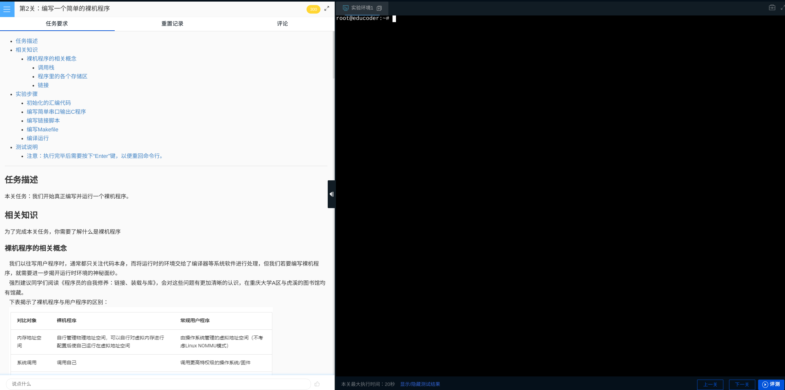

# 第2关：编写一个简单的裸机程序

1. 首先，启动您的linux



2. 创建一个名为`start.S`的文件

执行：
```bash
cat <<'EOF' > start.S
.extern main
.text
.globl _start
_start:
    # Config direct window and set PG
    li.w    $t0, 0xa0000011
    csrwr   $t0, 0x180
    /* CSR_DMWIN0(0x180): 0xa0000000-0xbfffffff->0x00000000-0x1fffffff Cached */
    li.w    $t0, 0x80000001
    /* CSR_DMWIN1(0x181): 0x80000000-0x9fffffff->0x00000000-0x1fffffff Uncached */
    # Enable PG
    li.w    $t0, 0xb0
    csrwr   $t0, 0x0
    /* CSR_CRMD(0x0): PLV=0, IE=0, PG */
    la  $sp, bootstacktop
    la  $t0, main
    jr  $t0
poweroff:
    b poweroff
_stack:
.section .data
    .global bootstack
bootstack:
    .space 1024
    .global bootstacktop
bootstacktop:
    .space 64
EOF
```

这将会把
> 实验步骤
>    初始化的汇编代码 
中的内容放到一个名为`start.S`的文件中。

> 解析：这是一个 Shell 的 here-document 语法，用于将多行文本输出到文件 start.S 中。
> `<<'EOF'` 表示从当前行开始读取直到遇到 EOF 行结束符。
> `> start.S` 将内容重定向到文件 start.S 中。

3. 创建一个名为`main.c`的文件

同理：

```bash

cat << 'EOF' > main.c

#define UART_BASE 0x9fe001e0
#define UART_RX     0   /* In:  Receive buffer */
#define UART_TX     0   /* Out: Transmit buffer */
#define UART_LSR    5   /* In:  Line Status Register */
#define UART_LSR_TEMT       0x40 /* Transmitter empty */
#define UART_LSR_THRE       0x20 /* Transmit-hold-register empty */
#define UART_LSR_DR         0x01 /* Receiver data ready */
void uart_put_c(char c) {
    while (!(*((volatile char*)UART_BASE + UART_LSR) & (UART_LSR_THRE)));
    *((volatile char*)UART_BASE + UART_TX) = c;
}
void print_s(const char *c) {
    while (*c) {
        uart_put_c(*c);
        c ++;
    }
}


void main() {
    print_s("\nHere is my first bare-metal machine program on LoongArch32!\n\n");
}
EOF

```

4. 编写链接脚本与Makefile

```bash
cat <<'EOF' > lab0.ld
SECTIONS
{
    . = 0xa0000000;
    .text : { *(.text) }
    .rodata : { *(.rodata) }
    .bss : { *(.bss) }
}
EOF

cat << 'EOF' > Makefile
TOOL    :=  loongarch32r-linux-gnusf-
CC      :=  $(TOOL)gcc
OBJCOPY :=  $(TOOL)objcopy
OBJDUMP :=  $(TOOL)objdump
QEMU    :=  qemu-system-loongarch32
.PHONY: clean qemu
start.elf: start.S main.c lab0.ld
	$(CC) -nostdlib -T lab0.ld start.S main.c -O3 -o $@
qemu: start.elf
	$(QEMU) -M ls3a5k32 -m 32M -kernel start.elf -nographic
clean:
	rm start.elf

EOF
```

* 现在可以编译您的程序了！


5. 编译并运行

**请注意**： 如果直接运行make会导致程序无法自动退出

因此要运行程序，请使用如下命令：

```bash

nohup make qemu > /data/workspace/myshixun/step1/a.txt &

```
如果要查看输出，请使用：
```bash
cat /data/workspace/myshixun/step1/a.txt
```
6. 运行结果

> root@educoder:~# cat /data/workspace/myshixun/step1/a.txt

>qemu-system-loongarch32 -M ls3a5k32 -m 32M -kernel start.elf -nographic
loongson32_init: num_nodes 1
loongson32_init: node 0 mem 0x2000000
> 
> Here is my first bare-metal machine program on LoongArch32!