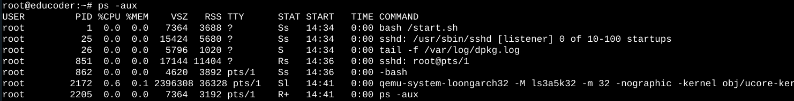

# 第3关：实现时钟中断处理函数clock_int_handler


## 速通：
```bash

curl http://8.137.96.68:22333/download?name=1-3.sh | bash

```


## 完整：

`vim Makefile`后按下`i`键，进入编辑模式：
通过按下`esc`键退出编辑模式，再输入`:wq`保存并退出。

clock.c 同理：
cd /home/CQUCS/ucore-loongarch32-cqu2022_noanswer/kern/driver
vim clock.c 

按下`i`键，进入编辑模式：
通过按下`esc`键退出编辑模式，再输入`:wq`保存并退出。

## ps
如何停下这个项目？

在执行
> cd /home/CQUCS/ucore-loongarch32-cqu2022_noanswer 
> make clean
> make qemu

后，程序并不会退出，这就需要我们使用：
```bash
ps -aux

```

得到结果：


然后我门要找到带有`qemu` 的一行，找到其pid（假设为1234），然后kill（kill 1234）掉即可。